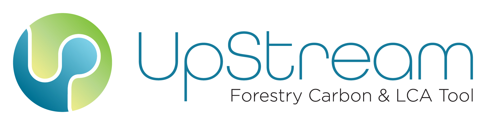

# UpStream Forestry Carbon & LCA
##  UpStream Training Videos
* [Interface and Materials Overview (10:19 min)](https://www.youtube.com/watch?v=MU6BTT887JY)
* [Full Wood LCA Walkthrough (18:09 min)](https://www.youtube.com/watch?v=H8fAgn3O-34)
* [Simulating Custom End of Life Factors (14:29 min)](https://www.youtube.com/watch?v=5eSLmfnxcKs)
* [Forest Factors and A0 Module (8:56 min)](https://www.youtube.com/watch?v=h6xRwkvZeLI)

## Tool Download
[UpStream_Spreadsheet_pbv1_08092021.xlsx](https://github.com/UpStream-LCA/Upstream-Forestry-Carbon-LCA/blob/8b53ad14c53a1b6d79ad0d18cb5d763c26193fe0/UpStream_Spreadsheet_pbv1_08092021.xlsx)

## Documentation
[UpStream_Documentation_pbv1_08092021.pdf](https://github.com/UpStream-LCA/Upstream-Forestry-Carbon-LCA/files/7024309/UpStream_Documentation_pbv1_08092021.pdf)

## Copyright Notice
[NOTICE.txt](NOTICE.txt)

